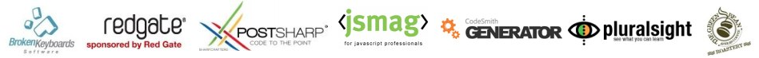
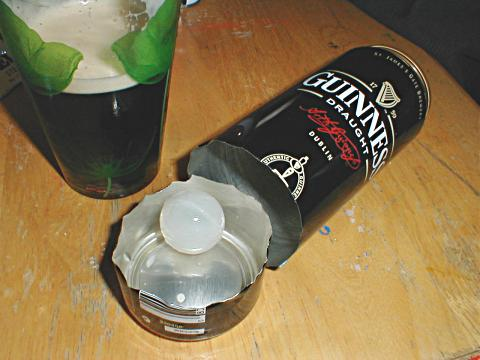

!SLIDE center

# Building JavaScript Widgets #

## Marc Heiligers ##
## [@marcheiligers](http://twitter.com/marcheiligers) ##
## CTO, Mad Mimi

JS in SA Conference 2011www.JSinSA.com

!SLIDE quote
# What are Widgets? #

JS in SA Conference 2011www.JSinSA.com

!SLIDE center aside
# What are Widgets? #

<a href='http://en.wikipedia.org/wiki/File:Widget_Guiness.jpg'>http://en.wikipedia.org/wiki/File:Widget_Guiness.jpg</a>

JS in SA Conference 2011www.JSinSA.com

!SLIDE quote aside
# What are Widgets? #
> A widget is a device placed in a container of beer to manage the characteristics of the beer's head. 
The original widget was patented in Ireland by Guinness. The "floating widget" is found in cans of 
beer as a hollow plastic sphere, 3 cm in diameter (similar in appearance to a small table tennis ball) 
with a small hole in one side. The "rocket widget" is found in bottles, 7 cm in length with the small 
hole at the bottom.

<a href='http://en.wikipedia.org/wiki/Widget_(beer)'>http://en.wikipedia.org/wiki/Widget_(beer)</a>

JS in SA Conference 2011www.JSinSA.com

!SLIDE quote
# What are Widgets? #
> In computer programming, a widget (or control) is an element of a graphical user interface (GUI) 
that displays an information arrangement changeable by the user, such as a window or a text box. 
The defining characteristic of a widget is to provide a single interaction point for the direct 
manipulation of a given kind of data. In other words, widgets are basic visual building blocks which, 
combined in an application, hold all the data processed by the application and the available 
interactions on this data.

<a href='http://en.wikipedia.org/wiki/Widget_(computing)'>http://en.wikipedia.org/wiki/Widget_(computing)</a>

JS in SA Conference 2011www.JSinSA.com

!SLIDE bullets

JS in SA Conference 2011www.JSinSA.com

# What are Widgets? #
* miscellaneous object designed for a specific purpose -ie- a scroll bar or button.
    - www.rigi.csc.uvic.ca/Pages/description/glossary.html
* A functional component that can be embedded in a web page via JavaScript. 
    - wiki.developer.flux.com/index.php
* A component of a graphical user interface that the user interacts with
    - en.wiktionary.org/wiki/widget

!SLIDE bullets
# What are Widgets? #
* Reusable components
* Graphical User Interface
* Display or get data to/from the user

JS in SA Conference 2011www.JSinSA.com

